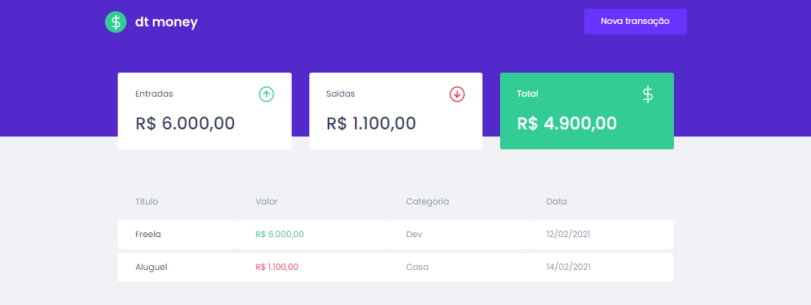

<h1 align="center">
  
</h1>

<h1 align="center">
  
</h1>

## 📋 Sobre

Dashboard de controle financeiro, onde são listadas as operações de entrada e saída cadastradas pelo usuário e estas informações são compiladas em uma seção de resumo.

---

## 🎯 Objetivo
A ideia deste projeto é estudar a utilização de componentes que compartilham informações entre si através da criação de **Contextos** do react, a utilização de **Styled Components** para estilização do app e a bliblioteca **MirageJS** para simulação de uma API backend;

---

## 🚀 Principais Conhecimentos explorados
- Hook "createContext"
- Criação de hooks personalizado
- Styled Components
- MirageJS

---

## 🛠 Como baixar o projeto

```bash

# Clonar o repositório
git clone https://github.com/lucasdsaints/dtmoney-reactjs.git

# Entrar no diretório
cd dtmoney-reactjs

# Instalar as dependências
yarn # npm install 

# Iniciar a API Fake e o projeto em si
yarn start # npm run start

```

---


Desenvolvido por mim, Lucas A. Santos 😛!
